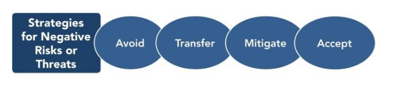

# Risk Management

## introduction
Four risk management steps are essential:
1. Identify Risks
2. Analyze & Evaluate Risks
3. Treat Risks
4. Monitor & Review Risks

## threats and opportunities
- effect on project scope, schedule, budget, or quality.
- Risks include 1. threats (negative impacts) and 2. opportunities (positive impacts).
- Risks that are threats to the project may be accepted if they are in balance with the rewards that may be gained from taking them.
- Communication about risk and its handling should be open and honest.

## 1. Identify risks

### Indetification methods:
- documentation reviews: previous project files, contracts, and other information. The quality of the plans, as well as consistency between those plans and the project requirements and assumptions.
- Assumptions Analysis: Assumptions analysis explores the validity of assumptions as they apply to the project.
- Fishbone Diagrams: also known as Ishikawa diagrams or fishbone diagrams, and are useful for identifying causes of risks.

- SWOT Analysis: (Strengths, Weaknesses, Opportunities, Threats) internal/external factors

### Risk registrer:

### Risk breakdown structure:
(RBS) is an organized way of categorizing the risks of a project.

## 2. Analyse & Evaluate risks

### Risk estimation: 

### Risk matrix: 
The Risk Matrix – also called “Probability-Impact Matrix” (PIM) 

The Risk Matrix is based on the principle that a risk has two primary dimensions:

- Probability (Likelihood) – A risk is an event that “may” occur. The probability of it occurring can range anywhere from just above 0 percent to just below 100 percent. (Note: It can’t be exactly 100 percent, because then it would be a certainty, not a risk. And it can’t be exactly 0 percent, or it wouldn’t be a risk.)
- Impact – A risk, by its very nature, always has a negative impact. However, the size of the impact varies in terms of cost and impact on health, human life, or some other critical factor.

### Sensitivity analysis:
You can develop what-if models or simulations to see the impact of a risk on either the budget or the schedule.
The outcomes are graphed in a **tornado diagram**.

- A tornado diagram can also be used for analyzing sensitivity in other project constraint objectives (cost, time, quality, and risk).
- The risks are presented in descending order, with the largest impact on the top and the least impact on the bottom

### Monte Carlo analysis:
you can consider the worst-case scenario by summing up the maximum expected values for all the variables. Similarly, you can calculate the best-case scenario. You can now use the Monte Carlo analysis and run simulations to generate the most-likely scenario for the event.

The Monte Carlo simulation randomly selects the input values for the different tasks to generate the possible outcomes. 
eg: Let us assume that the simulation is run 500 times:

## 3. Treat risks

### Dealing with threats:

1. Avoid: For example, using a certain supplier might carry the risk of them going out of business during the course of the project. This risk could be avoided by using a supplier who was bigger, better established and more financially secure.
2. Transfer: This involves transferring the risk to a third party so that they are responsible for its management and impact. It does not eliminate the risk it simply transfers the liability to someone else. 
Risk transference nearly always involves payment of a risk premium to the party taking on the risk and may introduce new risks.
3. Mitigate:    
    - Preventative action: involves aiming to prevent a high-risk situation from happening. It includes health and safety training, firewall protection on corporate servers, and cross-training your team.
    - Corrective action : include double-checking finance reports, conducting safety testing before a product is released, or installing sensors to detect product defects.
4. Accept:  It is usually chosen either because the risk is low in terms of impact or probability, or the cost and effort of taking a different action are out of proportion to the risk itself.

### Dealing with opportunities:

1. Exploit: Examples of directly exploiting responses include assigning an organization’s most talented resources to the project to reduce the time to completion or to provide lower cost than originally planned.
2. Share: Sharing a positive risk involves allocating some or all of the ownership of the opportunity to a third party who is best able to capture the opportunity for the benefit of the project.
3. Enhance:  adding more resources to an activity to finish early.
4. Accept: Accepting an opportunity is all about being willed to take advantage of it if it comes along, but not actively pursuing it.

## 4. Monitor & review risks

Not all risks can be eliminated – some risks are always present. Risk management is an ongoing process of identifying, treating, and then managing risks.

### Continuous improvement:
The firm’s monitoring and review processes should encompass all aspects of the risk management process for the purposes of:
- Ensuring that controls are effective.
- Obtaining further information to improve risk assessment.
- Analyzing and learning lessons from risk events, including near-misses, changes, trends, successes and failures.
- Detecting changes in the external and internal context, including changes to risk criteria and to the risks.
- Identifying emerging risks.

### Communication:

- Communicate and consult with internal and external stakeholders during any and all stages of the risk management process, particularly when plans are being first considered and when significant decisions need to be made.
- Risk management is enhanced when all parties understand each other’s perspectives and, where appropriate, are actively involved in decision-making. Methods of communication and consultation may include personal meetings, reports, learning packages, newsletters, and staff training.

- A collaborative and consultative team approach – through co-creation – is more likely to:
    - Ensure that risks are adequately identified
    - Bring together different areas of expertise
    - Ensure that different, and sometimes opposing, views are appropriately considered when defining risk criteria
    - Help secure endorsement and support for a treatment plan
    - Enhance any change management processes associated with the risk.
     